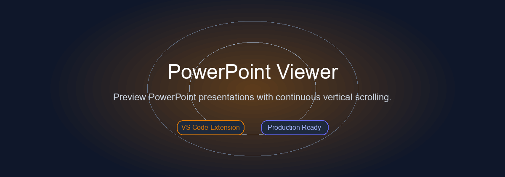
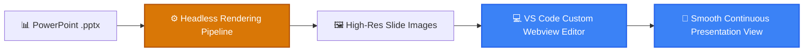

<p align="center">
  
</p>

<h1 align="center">📊 PowerPoint Viewer for VS Code</h1>

<p align="center">
  <strong>Directly preview PowerPoint files (.pptx) inside VS Code with high-fidelity slide rendering, continuous vertical scrolling, and zoom controls.</strong>
</p>

<p align="center">
  <a href="#-features">Features</a> •
  <a href="#-architecture">Architecture</a> •
  <a href="#-quick-start">Quick Start</a> •
  <a href="#-project-structure">Structure</a> •
  <a href="#-license">License</a>
</p>

<p align="center">
     
</p>

---

## ✨ Features (Key Outcomes & Capabilities)

| Icon | Feature | Outcome & Real Proof |
| :---: | :--- | :--- |
| 📜 | **Continuous Vertical Scrolling** | Scroll through all presentation slides seamlessly like a PDF without clicking next/prev buttons |
| 🎯 | **High-Fidelity LibreOffice Engine** | Accurately renders complex PowerPoint fonts, charts, smart shapes, and formatting |
| 🔍 | **Interactive Zoom & Navigation** | Zoom controls (50% - 200%) and quick thumbnail navigation drawer |
| ⚡ | **In-Editor Webview Integration** | Native VS Code custom editor integration with automatic cache management |

---

## 📊 Architecture & Flow



---

## 📁 Project Structure

```bash
powerpoint_viewer_extension/
├── 📁 src/                    # Custom Editor provider & Webview logic
├── 📁 media/                  # Icons & UI assets
├── 📄 package.json            # Extension manifest
└── 📄 README.md               # Documentation
```

---

## 🚀 Quick Start

### Prerequisites
- Check language runtimes (Python / Node.js) and system dependencies.

```bash
# Install from Marketplace:
ext install LoNebula9.powerpoint-viewer

# Or build locally:
npm install
npm run compile
```

---

## 💡 Usage Notes & Tips

> [!TIP]
> Ensure all required environment variables and dependencies are properly configured before execution.

---

<p align="center">
  Released under the <a href="LICENSE">MIT License</a>. Made with ❤️ by <a href="https://github.com/LoNebula">LoNebula</a>
</p>
