<p align="center">
  
</p>

<h1 align="center">📊 PowerPoint Viewer for VS Code</h1>

<p align="center">
  <strong>Directly Preview PowerPoint (.pptx) Presentations Inside VS Code with Continuous Vertical Scrolling & High-Fidelity Rendering.</strong>
</p>

<p align="center">
  <a href="#-overview">Overview</a> •
  <a href="#-features">Features</a> •
  <a href="#-code-architecture">Code Architecture</a> •
  <a href="#-system-flow">System Flow</a> •
  <a href="#-project-structure">Structure</a> •
  <a href="#-quick-start">Quick Start</a> •
  <a href="#-license">License</a>
</p>

<p align="center">
     
</p>

---

## 📌 Overview

A custom editor extension (`LoNebula9.powerpoint-viewer`) for VS Code that enables direct in-editor previewing of PowerPoint presentations (`.pptx`). Renders all slides as continuous vertical-scrolling high-resolution images, featuring zoom controls (50% to 200%), slide navigation, and automatic temporary file cleanup.

---

## ✨ Features (Key Outcomes & Capabilities)

| Icon | Feature | Outcome & Real Proof |
| :---: | :--- | :--- |
| 📜 | **Continuous Vertical Scrolling** | Scroll through all presentation slides seamlessly like a document without clicking next/previous |
| 🎯 | **High-Fidelity Rendering Engine** | Faithfully renders complex PowerPoint typography, smart shapes, and formatting via LibreOffice |
| 🔍 | **Interactive Zoom Controls** | Adjust magnification from 50% to 200% with real-time responsive scaling |
| 🧹 | **Automated Cache Cleanup** | Cleans temporary slide image caches automatically upon editor close |

---

## 🔬 Code Architecture & Implementation

### 🔬 Code Implementation (`src/`)
- **`previewProvider.ts`**: Implements `vscode.CustomReadonlyEditorProvider` registered to `powerpoint-viewer.preview`, hosting the interactive Webview.
- **`converter.ts`**: Orchestrates background headless LibreOffice rendering (`soffice --headless --convert-to pdf` followed by PDF page extraction) to render high-resolution slide PNGs.
- **Webview UI (`getHtmlForWebview`)**: Continuous vertical slide column with zoom controls, current slide indicator, and theme-adaptive styling.
- **Resource Management**: `cleanupAllTempFiles()` automatically purges extracted slide caches on editor disposal.

---

## 📊 System Flow

```mermaid
graph LR
  PPTX[📊 PowerPoint .pptx File] --> Provider[⚙️ PowerPointPreviewProvider]
  Provider --> Converter[🔄 Headless Conversion Pipeline]
  Converter --> SlideImages[🖼️ High-Res Slide PNGs]
  SlideImages --> Webview[💻 VS Code Custom Webview Editor]
  Webview --> Scroll[📜 Continuous Vertical Presentation View]

  classDef primary fill:#d97706,stroke:#b45309,stroke-width:2px,color:#fff;
  classDef accent fill:#3b82f6,stroke:#2563eb,stroke-width:2px,color:#fff;
  class Provider,Converter primary;
  class SlideImages,Webview,Scroll accent;
```



---

## 📁 Project Structure

```bash
powerpoint_viewer_extension/
├── 📁 assets/                 # Marketplace PNG hero banners
│   └── 🎨 hero.png
├── 📁 src/
│   ├── 📄 previewProvider.ts  # CustomReadonlyEditorProvider & Webview UI
│   ├── 📄 converter.ts        # LibreOffice headless conversion pipeline
│   └── 📄 extension.ts        # Extension activation & registration
├── 📄 package.json            # Extension manifest & custom editor schema
└── 📄 README.md               # Documentation
```

---

## 🚀 Quick Start

```bash
# Install from Marketplace:
ext install LoNebula9.powerpoint-viewer

# Or build locally:
npm install
npm run compile
```

---

<p align="center">
  Released under the <a href="LICENSE">MIT License</a>. Crafted with precision by <a href="https://github.com/LoNebula">LoNebula</a>
</p>
